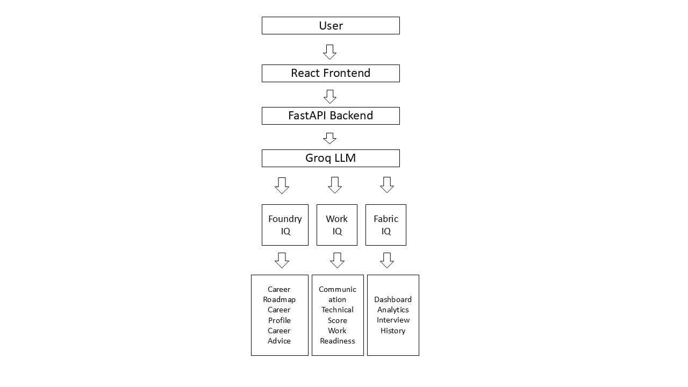
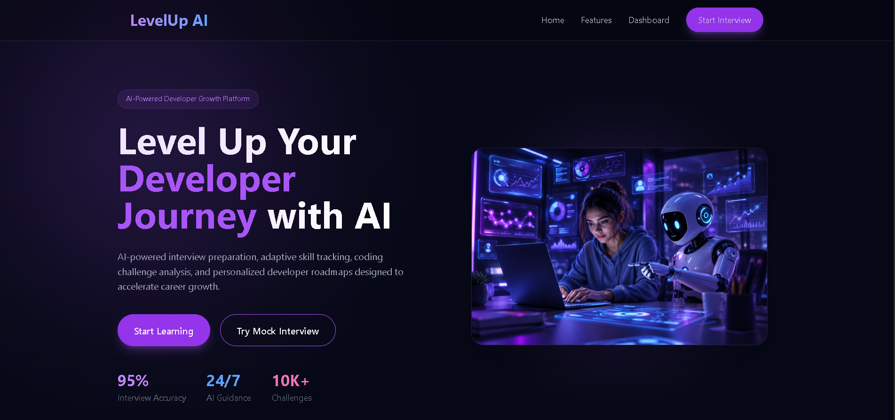
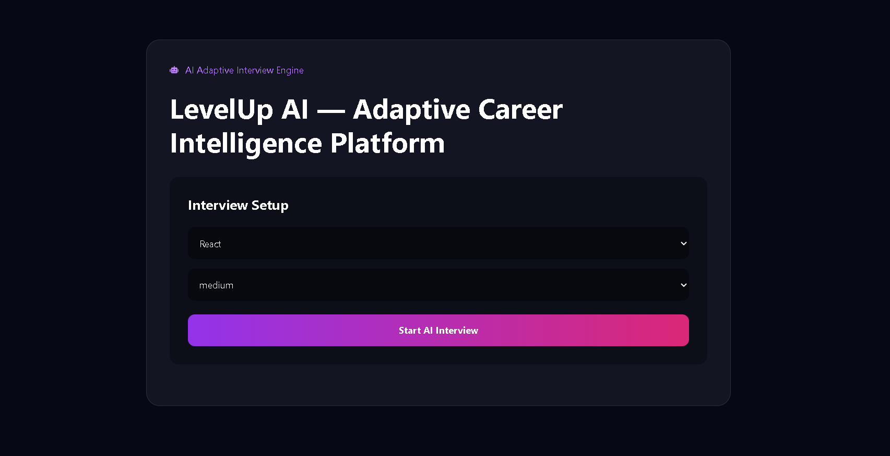
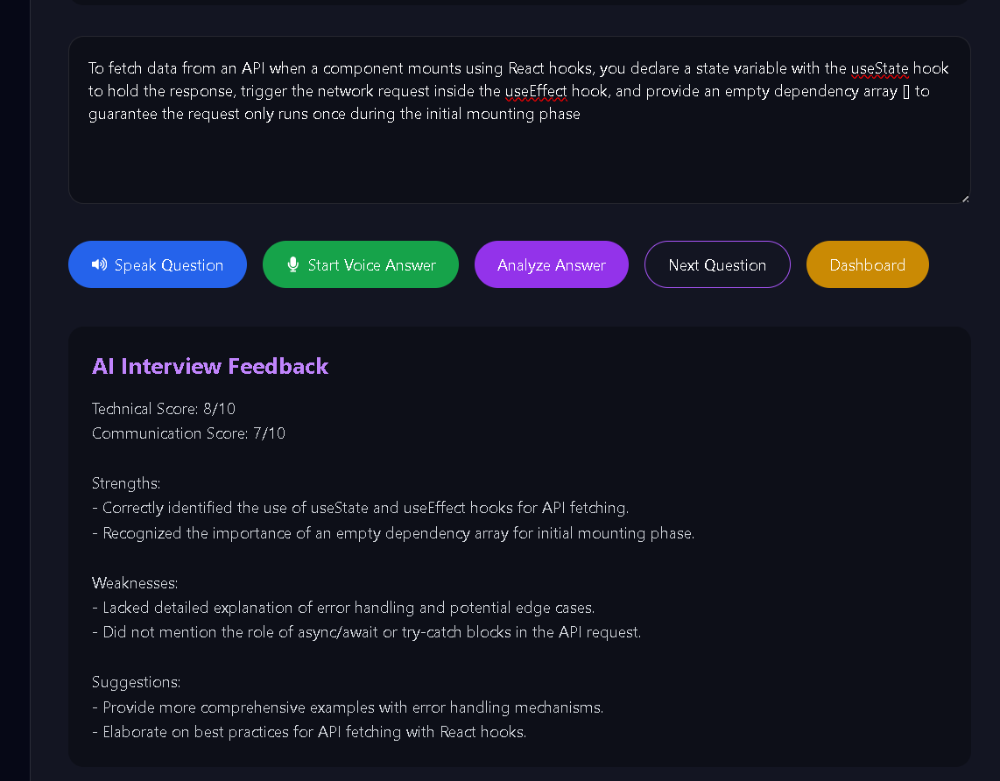
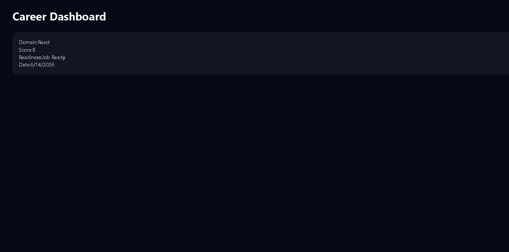

# 🚀 LevelUp AI — Adaptive Career Intelligence Platform

An AI-powered interview preparation and career intelligence platform that helps students and job seekers improve technical skills, communication skills, and career readiness through adaptive AI interviews.

## 🌐 Live Demo

### Frontend
https://levelup-ai-eight.vercel.app/

### Backend API
https://levelup-ai-e15e.onrender.com

---

## 📌 Problem Statement

Many students struggle to prepare for technical interviews because they lack:

- Personalized interview practice
- Real-time feedback
- Career guidance
- Skill gap identification
- Learning roadmaps

LevelUp AI solves this problem by providing adaptive AI-powered interviews, instant analysis, personalized learning roadmaps, and career intelligence insights.

---

## ✨ Features

### 🎯 Adaptive AI Interview Engine

- Domain-based interview generation
- Difficulty-based question generation
- Beginner, Intermediate, and Advanced levels
- Real-time AI-generated interview questions

### 🤖 AI Answer Analysis

- Technical Score Evaluation
- Communication Score Evaluation
- Strengths Identification
- Weakness Detection
- Improvement Suggestions

### 🗺 Personalized Learning Roadmap

- AI-generated learning roadmap
- Focused skill improvement plan
- Personalized recommendations

### 👨‍💼 Career Intelligence Engine

- Current Skill Assessment
- Readiness Percentage
- Recommended Job Roles
- Strength Area Detection
- Weak Area Detection

### 📈 Career Advice System

- Career Path Recommendations
- Salary Insights
- Future Skill Suggestions
- Learning Timeline

### 🏢 Work IQ Assessment

- Technical Intelligence
- Communication Intelligence
- Problem Solving Intelligence
- Collaboration Intelligence
- Leadership Potential

### 🎤 Voice Enabled Interview Experience

- Voice-based answering
- Interactive interview experience
- Improved interview simulation

---
## Architecture



## 📸 Screenshots

### 🏠 Home Page



### 🎯 Interview Dashboard



### 🤖 AI Feedback Analysis



### 📊 Career Intelligence Dashboard



---

## 🛠 Tech Stack

### Frontend

- React.js
- Vite
- Tailwind CSS
- Axios
- Framer Motion
- React Router

### Backend

- FastAPI
- Python
- Pydantic

### AI

- Groq API
- Llama 3.3 70B Versatile

### Deployment

- Vercel
- Render

---

## 🏗 System Architecture

```text
Frontend (React + Vite)
          │
          ▼
      Axios API
          │
          ▼
Backend (FastAPI)
          │
          ▼
      Groq AI
          │
          ▼
 Career Intelligence Engine
```

---

## ⚙ Installation

### Clone Repository

```bash
git clone https://github.com/anupalla15/levelup-ai.git
cd levelup-ai
```

### Frontend Setup

```bash
npm install
npm run dev
```

### Backend Setup

```bash
pip install -r requirements.txt
uvicorn main:app --reload
```

---

## 🔑 Environment Variables

Create a `.env` file:

```env
GROQ_API_KEY=YOUR_GROQ_API_KEY
```

---

## 📡 API Endpoints

### Generate Question

```http
POST /generate-question
```

### Analyze Answer

```http
POST /analyze
```

### Generate Roadmap

```http
POST /roadmap
```

### Career Profile

```http
POST /career-profile
```

### Career Advice

```http
POST /career-advice
```

### Work IQ Assessment

```http
POST /work-iq
```

---

## 🎯 Use Cases

- Interview Preparation
- Placement Training
- Career Guidance
- Skill Assessment
- Learning Roadmap Generation
- Technical Interview Practice

---

## 🚀 Future Enhancements

- Resume Analyzer
- ATS Resume Scoring
- AI Resume Builder
- HR Interview Simulation
- Multi-Language Support
- Interview History Tracking
- Personalized Progress Tracking

---

## 👨‍💻 Developer

### Poornima Palla

Final Year B.Tech Student

GitHub:
https://github.com/anupalla15

LinkedIn:
https://www.linkedin.com/in/anupalla15/

---

## 🏆 Highlights

✅ AI-Powered Interview Platform

✅ Adaptive Question Generation

✅ Real-Time Feedback Analysis

✅ Career Intelligence Engine

✅ Personalized Learning Roadmaps

✅ Voice Enabled Interview System

✅ Fully Deployed Cloud Application

---

## 📜 License

This project is developed for educational, learning, and hackathon purposes.